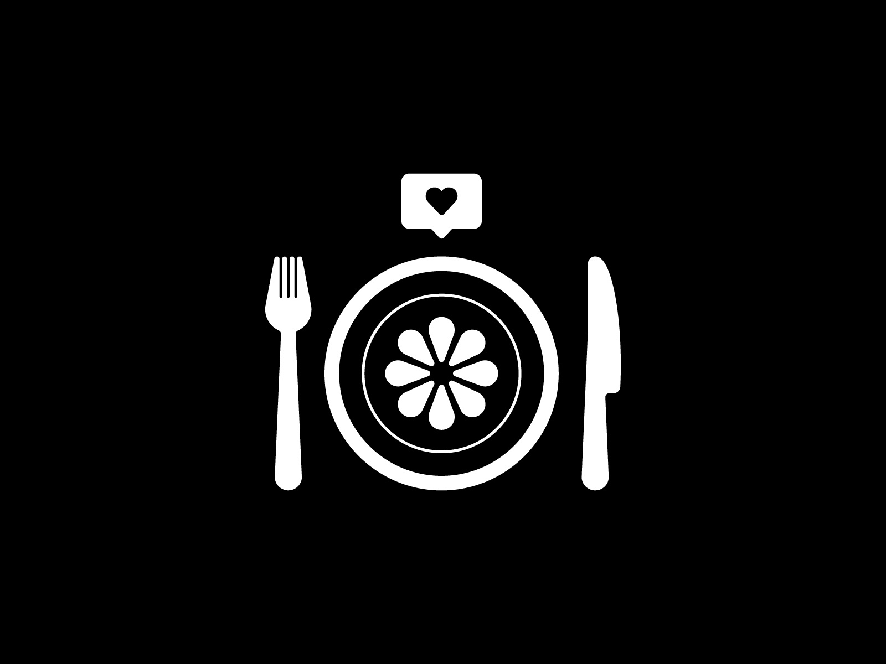

<!DOCTYPE html>
<html>
     <head>
      <title>My bussines Webpage</title>
      
          
           
            </head>
            <body>
            
           
                <ul>
                    <li><a href="Linked_Pages/home.html">Home</a></li>
                    <li><a href="Linked_Pages/menu.html">menu</a></li>
                    <li><a href="Linked_pages/contact.html">Contact</a></li>
                    <li><a href="Linked_pages/about my website.html">about</a></li>
      <link rel="stylesheet" href="US_stylesheet_1.css">
      <h1>Welcome to soba restraunt</h1>
    </body>
    </h1>
    </html> 
          
       </head>
       </html>
